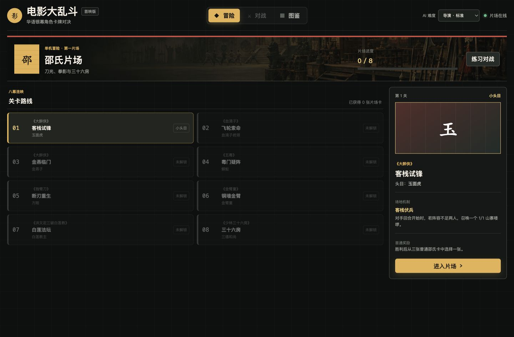
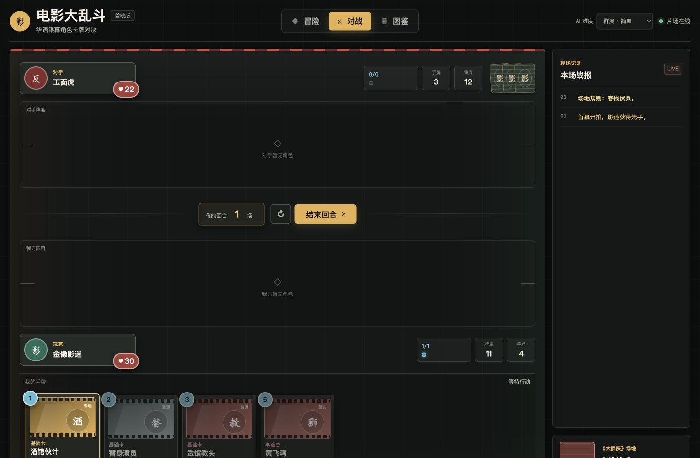

# Movie Brawl

A small server-authoritative solo card game featuring characters from classic
Hong Kong and Mainland Chinese films and television series.

> Current version: `0.1.0` solo adventure MVP. Card balance and content are
> still in development. PVP, accounts, and cloud saves are not included yet.





## Why I Built This Game

I have always loved Hong Kong cinema, especially nostalgic classics that carry
the texture and shared memories of their time. I am also a card game fan, so I
wanted to bring familiar screen characters and studio stories into a card
battler that can keep growing over time.

## Game Content

- 10 stars with 6 character cards each, for a total of 60 character cards.
- Instant Chinese and English switching across the interface, all 177 cards,
  adventure content, battle logs, and error messages.
- A 15-card beginner deck with four 1-cost cards, five 2-cost cards, four
  3-cost cards, and two core cards. Opening hands are fully shuffled and may
  occasionally have an awkward curve.
- 105 Basic and Classic cards, plus 72 characters, spells, and weapons earned
  through the Shaw Studio, Golden Harvest Studio, Cinema City Studio, and
  D & B Studio adventures.
- Four independent eight-stage studio adventures. In each route, stages 3 and 5
  are mid-bosses and stage 8 is the final boss.
- Shaw Studio favors durable formations, Taunt, Shield, and gradual training.
  Golden Harvest favors attack-heavy characters, weapons, Rush, Combo chains,
  and armed Stunts. Cinema City favors Partner ensembles, Comeback turns, and
  returning characters to hand for another entrance. D & B rewards reading the
  board through Solo, two-track choices, and Handover after a friendly character
  leaves play. Later bosses use a higher proportion of their studio cards.
- Defeating a standard boss for the first time offers a choice of three common
  cards. Mid-bosses and the final boss award their corresponding boss cards.
- Adventure progress and the collection are stored in a local server save.
  Locked studio cards cannot enter the player's deck.
- A 1v1 battle system with Film Power, decks, hands, boards, fatigue, and
  victory resolution.
- Three independent AI strategies: Easy, Normal, and Hard.
- Taunt, Shield, Rush, Lifesteal, Stun, Summon, Deathrattle, Retaliate,
  Fusion, Partner, Comeback, Return-to-Hand, Solo, Two-Track, and Handover
  mechanics.
- Weapons have Attack and Durability, allowing the hero to attack once per
  turn while equipped.
- Collection search and filtering, deck composition details, and local career
  records.

## Getting Started

On macOS, double-click the included `.command` launcher.

Alternatively, run this command from the project directory:

```bash
npm start
```

Then open <http://127.0.0.1:4173>.

The project requires Node.js 20 or later and has no third-party runtime
dependencies.

Your language choice is saved in the current browser. Chinese and English use
the same card rules, adventure progress, and `data/profile.json` save. Changing
language does not restart an active match.

Save files carry a schema version and are migrated automatically. Invalid save
data is preserved as a timestamped backup before the game starts a clean
profile.

## How to Play

1. Choose Shaw Studio, Golden Harvest Studio, Cinema City Studio, or D & B
   Studio from the Adventure screen and challenge that studio's eight stages
   in order.
2. After defeating a standard boss, choose one of three cards. Mid-bosses and
   the final boss unlock their corresponding boss cards directly.
3. Reward cards replace the closest-cost Basic card of the same type, keeping
   the deck at 15 cards.
4. Progress is stored in `data/profile.json`. Delete this file to reset the
   adventure save.

## Project Structure

```text
.
├── index.html                 # Page structure
├── styles.css                # Visual design and responsive layout
├── app.js                    # Browser bootstrap
├── card-builders.js          # Shared role, spell, and weapon definition helpers
├── studio-registry.js        # Single registry for studio content and rule modules
├── game-data.js              # Shared client/server card data
├── shaw-cards.js             # Shaw Studio reward cards
├── shaw-adventure.js         # Eight-stage adventure configuration
├── golden-harvest-cards.js   # Golden Harvest reward cards
├── golden-harvest-adventure.js # Second eight-stage adventure
├── cinema-city-cards.js      # Cinema City reward cards
├── cinema-city-adventure.js  # Third eight-stage adventure
├── d-and-b-cards.js          # D & B reward cards
├── d-and-b-adventure.js      # Fourth eight-stage adventure
├── starter-cards.js          # Beginner common cards
├── assets/                   # Original game visual assets
├── localization/             # UI, card, film, adventure, and log translations
├── server.js                 # HTTP server and static asset entrypoint
├── client/
│   ├── game-controller.js    # Frontend flow controller
│   ├── i18n.js               # Browser localization entrypoint
│   ├── game-api-client.js    # Match API client
│   ├── battle-view.js        # Battle board view
│   ├── card-renderer.js      # Card and inspector rendering
│   ├── collection-view.js    # Collection view
│   ├── adventure-view.js     # Adventure map and stage details
│   ├── outcome-view.js       # Results and reward selection
│   └── feedback-view.js      # Loading, error, and outcome feedback
├── server/
│   ├── static-file-catalog.js # Explicit public asset boundary
│   ├── game-engine.js        # Public battle engine entrypoint
│   ├── game-service.js       # Match session management
│   ├── content/              # Stable card ID contract
│   ├── adventure/            # Catalog, save migrations, rewards, and studio rules
│   └── game/
│       ├── game-engine.js    # Action orchestration
│       ├── game-state.js     # Match state and lifecycle
│       ├── card-factory.js   # Deck and card instances
│       ├── card-zone-manager.js # Deck, hand, graveyard, burn, and exile transitions
│       ├── combat-resolver.js # Attacks and damage
│       ├── effect-resolver.js # Card effects
│       ├── death-resolver.js # Deathrattles and death queue
│       ├── advanced-effect-handlers.js # Fusion and Retaliate buffs
│       ├── cinema-city-effect-handlers.js # Partner, Comeback, and Return effects
│       ├── d-and-b-effect-handlers.js # Solo, Two-Track, and Handover effects
│       ├── effect-handler-extensions.js # Registers studio-specific effect groups
│       ├── ai-director.js    # AI turn orchestration
│       ├── ai/               # Three AI difficulty strategies
│       └── game-serializer.js # Client-safe match state
└── test/
    ├── content-and-adventure.test.js # Card data and progression rules
    ├── *-mechanics.test.js   # One focused suite per studio
    ├── game-engine.test.js   # Core combat regression tests
    ├── profile-repository.test.js # Save validation and migration
    ├── registry-and-http.test.js # Content registration and HTTP boundaries
    ├── i18n.test.js          # Chinese and English coverage
    └── architecture.test.js  # Module boundary checks
```

The browser only submits actions. The server validates and resolves Film Power
costs, legal targets, combat, card effects, AI turns, and victory through
`server/game-engine.js`. Standard effects are registered in `EffectResolver`,
while compound mechanics such as Fusion belong in `AdvancedEffectHandlers`.
`CardZoneManager` owns transitions between the deck, hand, board, graveyard,
burned pile, exile, and weapon slot. Recorded zone entries preserve the card's
last state, owner, turn, order, and reason for leaving play.

Boss battles use a separate `BossEncounter` layer for stage rules and phase
effects. Each studio owns an encounter-rule class, while `StudioRegistry`
provides the shared card sets, adventures, rule classes, art, and optional
effect handlers. Adding another studio begins with one registry entry instead
of editing the game engine. Reward cards use standard constructed-play data and
never inherit a boss's bonus health, exclusive weapon, or encounter ability.

Existing card IDs are protected by a versioned contract because collection
saves store those IDs. An intentional ID change must add a profile migration
before the contract is updated.

## Testing

```bash
npm test
```

The test suite covers card data, the beginner mana curve, server-side action
validation, three AI strategies, combat keywords, Deathrattle resolution,
card-zone transitions, all studio boss rules, adventure progression and
rewards, save migration, registered HTTP/static boundaries, bilingual content,
and architecture rules that prevent the project from collapsing back into a
monolith.

## Development Status

- Complete: server-authoritative battles, three AI difficulties, a 15-card
  beginner deck, four eight-stage studio adventures, 177 cards, bilingual
  presentation, and local saves.
- In progress: stage balance, consistent card wording, animation, and audio
  feedback.
- Planned: more studios, deck building, save slots, and a complete tutorial.

## Content Notice

This is a non-commercial learning project and game prototype. The rights to
film and television titles, characters, and related names belong to their
respective owners. The interface and original visual assets in this repository
are included only to demonstrate game design and engineering work.
